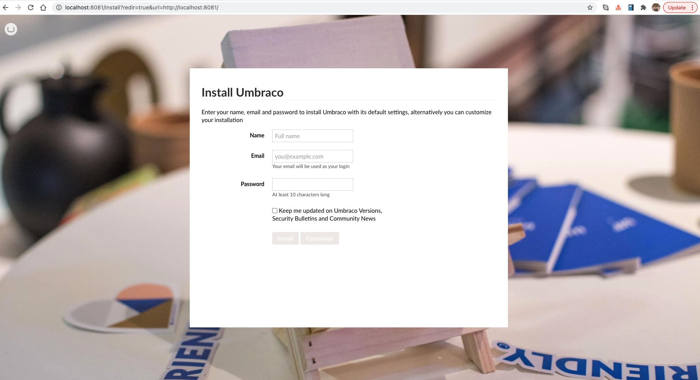

# umbraco-in-containers
Run Umbraco easily with docker.

Build and run with the following commands:

```bash
    docker build -t umbraco .
    docker run -p 8081:80 -n umbraco-container umbraco
```

Open your browser window on localhost with the port you specified.



[Demo video to deploy Umbraco in a container easily on Azure App Service](https://www.youtube.com/watch?v=txyYlwEdnbM)

Find more free learning about containers at [aka.ms/az-learn-docker.](https://aka.ms/az-learn-docker)
